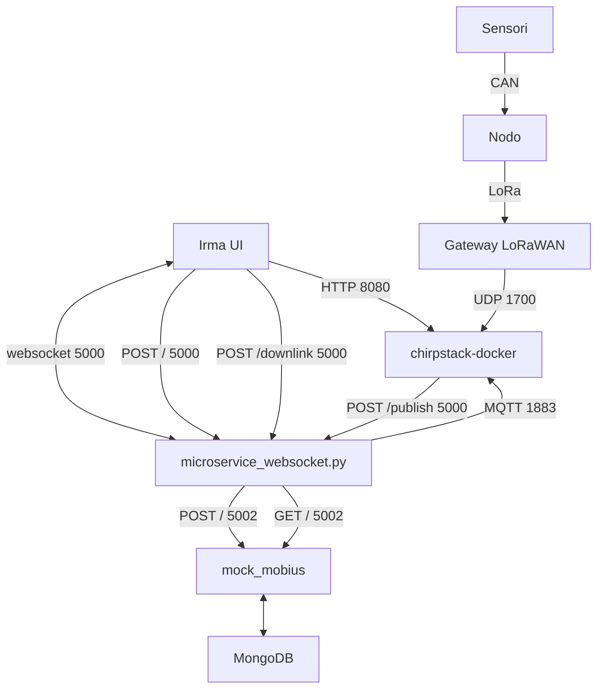
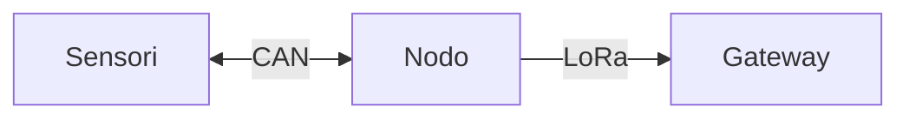
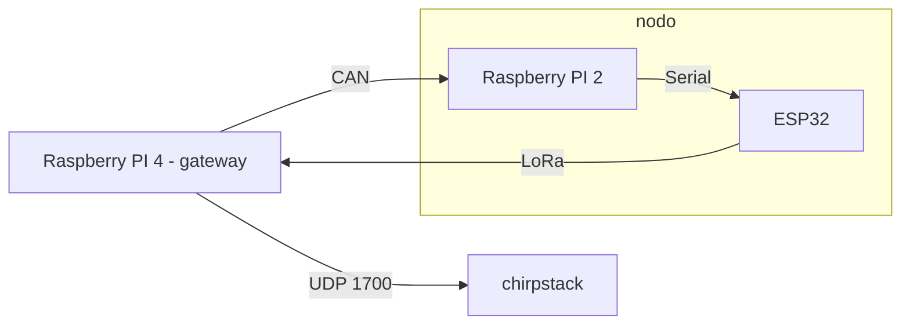

# PROGETTO IRMA 

## DESCRIZIONE PROGETTO

Rete di comunicazione a lunga gittata tramite protocollo LoRa per la trasmissione di dati raccolti da sensori verso il server che raccoglie e elabora i dati ritrasmettendoli tramite un web-service a una dashboard.

### Struttura progetto


## DEPLOYMENT

All'interno della **root** principale è presente il file [docker-compose.yaml](docker-compose.yaml), grazie al quale è possibile dispiegare l'intero stack di servizi, **chirpstack**, **mock_mobius** e **microservice_websocket**. All'interno della cartella [config](config/) sono presenti anche i file di configurazione dei vari servizi lanciati da docker.

Per utilizzare [docker-compose.yaml](docker-compose.yaml):

    docker-compose up -d
    
Per visualizzare i logs:

    docker-compose logs -f

Per fermare i container (e smontare i volumi):

    docker-compose down (-v)
    
Il [Chirpstack Application Server](https://www.chirpstack.io/application-server/) è raggiungibile mediante la porta 8080 sull'host. Le credenziali predefinite per accedere alla dashboard sono username: `admin` e password: `admin`.

### Encode e decode del payload

All'interno della cartella [chirpstack-docker](chirpstack-docker) è presente il file [encode_decode.js](chirpstack-docker/encode_decode.js) che contiene il codice da integrare nella sezione ** dell'interfaccia web dell'Application Server.

### Struttura interna [docker-compose.yaml](docker-compose.yaml) (semplificata)


Per la versione [completa](assets/schema_docker_compose_completo.md).

## GATEWAY


Per la connessione del gateway è stato utilizzato un **HAT RAK2245** e un **Raspberry Pi 4B+** con relativa repository per l'installazione del service:
  
    $ sudo apt update; sudo apt install git -y
  
    $ git clone https://github.com/RAKWireless/rak_common_for_gateway.git ~/rak_common_for_gateway
  
    $ cd ~/rak_common_for_gateway
  
    $ sudo ./install.sh

Dopo queste operazioni si può eseguire il comando `sudo gateway-config` per configurare la connessione del proprio gateway al server.


## END-DEVICE

Per connettere un nuovo end-device su lorawan è necessario sapere il Device EUI che viene fornito dalla scheda che si usa e bisogna fare il join tramite una delle due modalità **(OTAA o ABP)**.

Bisogna creare una applicazione sul server tramite interfaccia web Applications > Create.

Successivamente va registrato il device Applications > [Nome applicazione_da_utilizzare] > Create.
Bisogna inserire il device EUI durante la registrazione, esso viene fornito dal produttore nella sua documentazione.

Sull'end device nel file [serial_esp_lora_oled.ino](arduino-py-communication/serial_esp_lora_oled.ino) vanno inseriti i dati relativi alle chiavi della rete che si trovano all'interno del menu del device creato in precedenza sul server.

Per la lettura dei dati va scritto un decoder su misura per i dati che verranno ricevuti sul device profile selezionato per la crezione del device sull'application server. Viene fornito un esempio qui: [encode_decode.js](chirpstack-docker/encode_decode.js).

Durante la fase di registrazione è necessario inserire anche i dati relativi alla piattaforma Mobius (sensorId e sensor_path) nella sezione Tags del sensore.

> :warning: **Warning**: *Il file **.ino** fornito nella repository è stato testato solo su un **Heltec ESP32** e non è garantito il funzionamento su altri dispositivi non basati su ESP32* :warning:


Per aggiungere la lettura dei dati dai sensori è stato utilizzato il protocollo CAN con l'aggiunta di un **Raspberry Pi 2B** in modo da ricevere i dati sulla interfaccia seriale 


### Struttura nodo/end-device



## WEB-SERVICE E SALVATAGGIO DEI DATI

Il server chirpstack non mantiene i dati trasmessi dagli end-device in nessun modo permanente, perciò sull'application server da interfaccia web deve essere attivata l'integrazione con HTTP, che permette di eseguire una POST con l'intero payload in formato JSON. 

L'immagine [microservice_websocket_docker](microservice_websocket_docker/) ha diversi ruoli, tra cui:

  - Ricezione delle POST su '/publish' contenenti i dati di chirpstack. Questi poi saranno inoltrati a [mock_mobius_docker](mock_mobius_docker/) che simula il comportamento della piattaforma Mobius (piattaforma per la registrazione dei dati).
  - Fornitura dati alla dashboard mediante POST su '/' e WebSocket. Queste ultime devono contenere un payload json contenente un array di sensor_paths per interrogare [mock_mobius_docker](mock_mobius_docker/).

Esempio payload: 

```json
{
  "paths": [01230213] // esempio
}
```

  - Ricezione delle POST su '/downlink', provenienti dalla dashboard. Queste ultime servono per inviare messaggi di downlink al sensore, tramite chirpstack, e devono contenere un payload json.

Esempio payload:

```json
{
  "statoStaker": 1, // opzioni possibili 0-1 (stop-start)
  "applicationID": "1", // applicationID di chirpstack
  "devEUI": "AgICAgICAgI=" // deviceEUI ricevuto da chirpstack (non decodificato)
}
```

### Opzioni [microservice_websocket_docker](microservice_websocket_docker/)

È possibile specificare le seguenti opzioni tramite variabili d'ambiente:

- **MAX_TRESHOLD**: valore della soglia di pericolo dei sensori, default `20`.
- **MOBIUS_URL**: l'indirizzo dell'istanza Mobius, default `http://localhost`.
- **MOBIUS_PORT**: la porta su cui è esposto il servizio, default `5002`.
- **DISABLE_MQTT**: disabilita il servizio MQTT per il testing, True se settato ad 1, default False.
- **MQTT_BROKER_URL**: url del serivizo MQTT per comunicare con Chirpstack, default `localhost`.
- **MQTT_BROKER_PORT**: porta del servizio MQTT per comunicare con Chirpstackm default `1883`.

### Avvio di [microservice_websocket_docker](microservice_websocket_docker/)

Nel caso in cui si volesse avviare **standalone**, viene fornito il file **docker-compose.yaml** all'interno della cartella [microservice_websocket_docker](microservice_websocket_docker/).

Per i comandi di **docker-compose** fare riferimento al paragrafo **DEPLOYMENT**.

### Avviare [mock_mobius](mock_mobius/)

Come per [microservice_websocket_docker](microservice_websocket_docker/), è presente il file [docker-compose.yaml](mock_mobius/docker-compose.yaml) che permette di far partire **standalone** il servizio di **mock_mobius** e il database [MongoDB](http://mongodb.com) ad esso associato.

Per i comandi di **docker-compose** fare riferimento al paragrafo **DEPLOYMENT**.

All'interno del docker-compose è possibile cambiare il mapping della **porta**, di default `5002`.

## COMANDI

Il file [downlink.py](downlink.py) si occupa dell'invio dei comandi di Start e Stop all'application server tramite MQTT, il quale a sua volta invierà un messaggio di downlink verso l'end-device con il comando ricevuto il quale fermerà o avvierà la lettura dei dati dai sensori. Questo script serve per il test dei comandi senza dashboard.

Per l'utilizzo degli stessi comandi ma da dashboard in remoto si usa il file [downlink_microservice.py](mockHttp/downlink_microservice.py) che riceve un post dalla dashboard con un valore numerico che definisce il messaggio da inviare tramite MQTT(Start o Stop) e due valori che rappresentano gli id dell'applicazione e del dispositivo che servono per pubblicare sul topic dell'application server.

Per l'utilizzo gli stessi comandi ma da dashboard in remoto, si possono effettuare delle POST su '/downlink' di microservice_websocket. Con un valore numerico (statoStaker) definisce il messaggio da inviare tramite MQTT (Start o Stop) e due valori che rappresentano applicationID e il devEUI del dispositivo decodificato, per pubblicare sul topic di chirpstack-application-server.


## TESTING IN LOCALE

Al fine di eseguire dei test in locale per mancanza di una rete LoRaWAN da utilizzare sono stati utilizzati due script:

1. [auto_can.py](auto_can.py) - 
    Questo script eseguito (solo per test) sul gateway invia tramite interfaccia CAN due messaggi a intervalli regolari.
    
2. [arduino_communication.py](arduino-py-communication/arduino_communication.py) - 
    Questo script eseguito su un Rapberry Pi connesso all'ESP32 riceve tramite interfaccia CAN i messaggi che successivamente ritrasmetterà attraverso intefaccia seriale all'end-device.


Questo sistema sotituisce la necessità di una rete e di sensori funzionanti per fare test sul funzionameto della infrastruttura di rete.

### Struttura testing locale



### Inizializzazione interfaccia CAN

Per utilizzare l'interfaccia CAN è talvolta necessario inizializzarla prima di eseguire gli script sopra-citati.

Le istruzioni da eseguire sono:

    $ sudo modprobe peak_usb
    $ sudo ip link set can0 up type can bitrate 500000
    
Per maggiori info consultare la documentazione di [python-can](https://python-can.readthedocs.io/en/stable/interfaces/socketcan.html#pcan).
