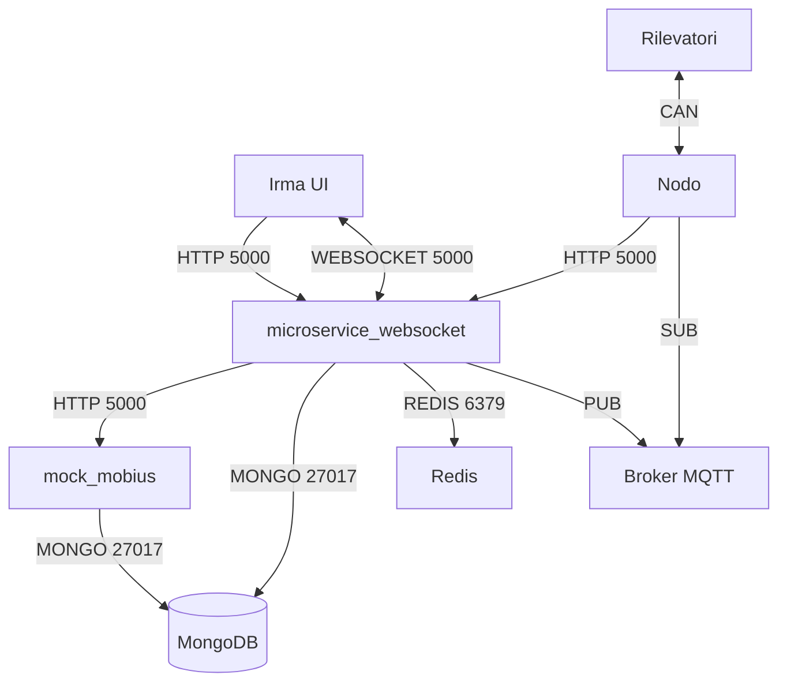
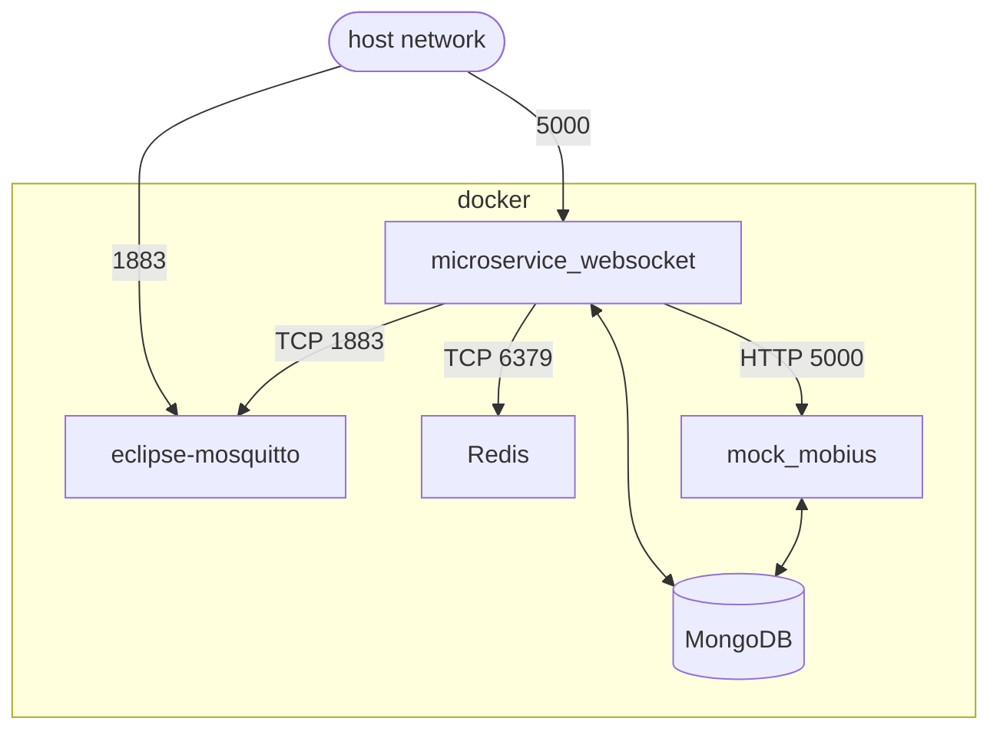
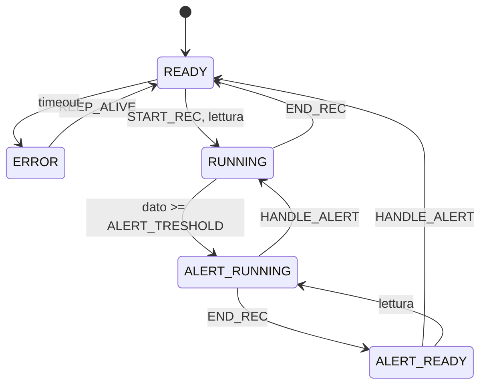
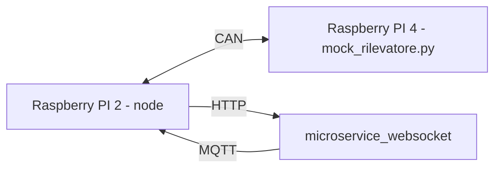

# PROGETTO IRMA 

I risultati dei test al seguente url:

* [https://irma-tests.netlify.app/](https://irma-tests.netlify.app/)

Per visualizzare la copertura del codice:

* [https://irma-tests.netlify.app/coverage](https://irma-tests.netlify.app/coverage)


## Descrizione progetto

Rete di comunicazione per **trasmissione e raccolta** dati dei sensori. Il server che li riceve si occupa poi di elaborarli ed inviarli alla **dashboard web** [irma-ui](https://github.com/monemasrl/irma-ui.git).

### Struttura progetto



## DEPLOYMENT

All'interno della **root** principale è presente il file [docker-compose.yaml](./docker-compose.yaml), grazie al quale è possibile dispiegare l'intero **stack di servizi**.

### Schema docker-compose.yaml




## GLI ENUM

Per **ridurre** il **numero di dati** trasmessi, ma al contempo **mantenere la leggebilità**, sono stati creati diversi **IntEnum** per identificare diverse proprietà.

### PayloadType

Identifica i messaggi inviati.

| Nome         | Valore |
|--------------|--------|
| READING      |   0    |
| START_REC    |   1    |
| END_REC      |   2    |
| KEEP_ALIVE   |   3    |
| HANDLE_ALERT |   4    |


### CommandType

| Nome       | Valore |
|------------|--------|
| START_REC  |    0   |
| END_REC    |    1   |

### SensorState

Rappresenta lo stato che può essere assunto dai vari sensori.

| Nome          | Valore |
|---------------|--------|
| ERROR         |   0    |
| READY         |   1    |
| RUNNING       |   2    |
| ALERT_READY   |   3    |
| ALERT_RUNNING |   4    |

Il **cambiamento di stato** varia secondo il seguente schema:



## NODO

Sul nodo (nel nostro caso un Rapsberry PI 2) gira uno script che si occupa di **gestire** i rilevatori.

Per maggiori informazioni consultare la [documentazione](./node/node.md).

## WEB-SERVICE E SALVATAGGIO DEI DATI

I due servizi principali che si occupano di memorizzazione ed elaborazione dei dati sono:

- `microservice_websocket`.
- `mock_mobius` (che simula la piattaforma **Mobius**).

In particolare, mentre `mock_mobius` si occupa soltanto di immagazzinare dati, `microservice_websocket` si occupa anche di **elaborarli** ed inviarli alla [ui](https://github.com/monemasrl/irma-ui.git) e di **inviare i comandi** ai nodi.

Per maggiori informazioni su **microservice_websocket** consultare la sua [documentazione](./microservice_websocket/microservice_websocket.md).

## TESTING IN LOCALE

Al fine di eseguire dei test in locale, per mancanza di rilevatori da utilizzare, vengono usati rispettivamente: 

- [mock_rilevatore.py](./utils/mock_rilevatore.py), che si occupa di **simulare** la presenza di **un rilevatore**.
- [mock_4rilevatori.py](./utils/mock_rilevatore.py), che si occupa di **simulare** la presenza di **4 rilevatori**.

### Struttura testing locale



## CONTRIBUTING

Nella repo sono presenti i file di **configurazione per un pre-commit hook**, che avvia tool di *linting* e *formattazione*.

Per installare pre-commit: [sito ufficiale](https://pre-commit.com/).

Una volta installato basta eseguire:

```bash
$ pre-commit install
```

Per **installare gli hook** nella repo.
