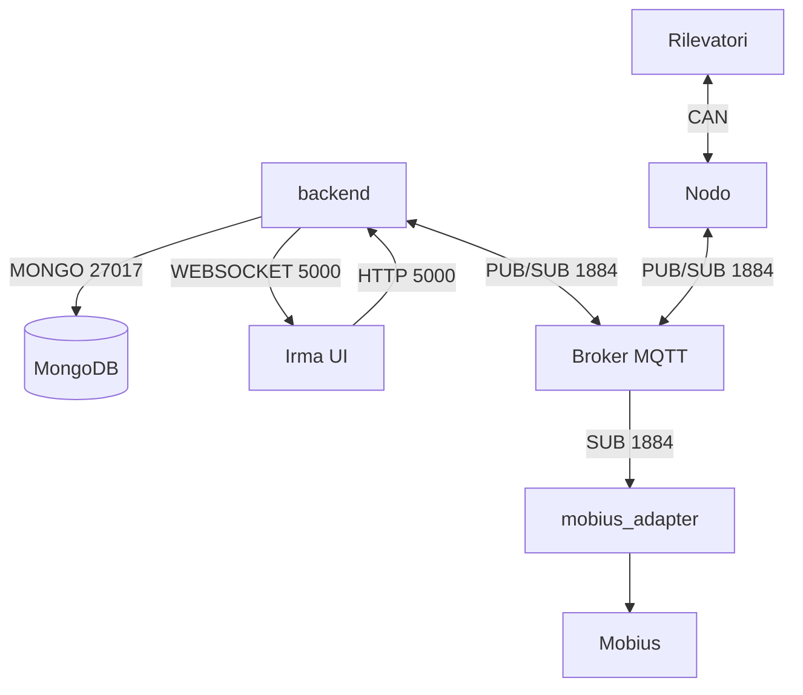
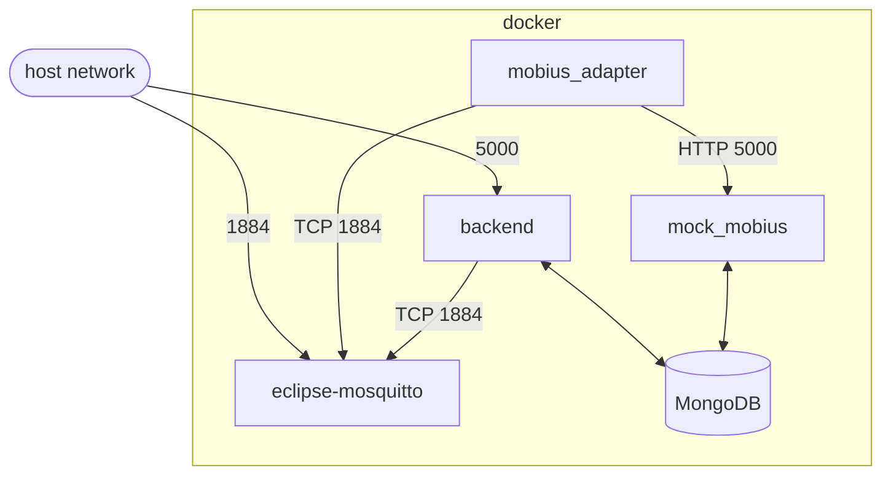
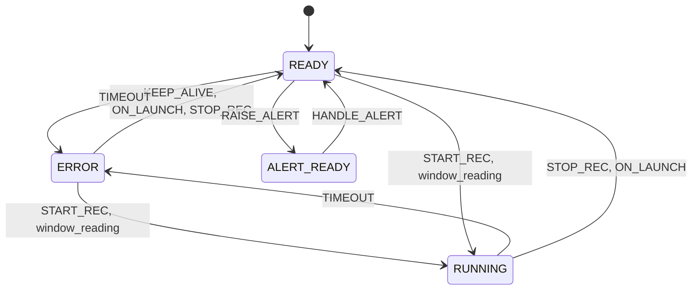

# PROGETTO IRMA 

I risultati dei test al seguente url:

- [https://irma-tests.netlify.app/](https://irma-tests.netlify.app/)

Per visualizzare la copertura del codice:

- [https://irma-tests.netlify.app/coverage](https://irma-tests.netlify.app/coverage)

## Descrizione progetto

Rete di comunicazione per **trasmissione e raccolta** dati dei sensori. Il server che li riceve si occupa poi di elaborarli ed inviarli alla **dashboard web** [irma-ui](https://github.com/monemasrl/irma-ui.git).

### Struttura progetto



## DEPLOYMENT

All'interno della **root** principale è presente il file [docker-compose.yaml](./docker-compose.yaml), grazie al quale è possibile dispiegare l'intero **stack di servizi**.

### Schema docker-compose.yaml



## GLI ENUM

Per **ridurre** il **numero di dati** trasmessi, ma al contempo **mantenere la leggebilità**, sono stati creati diversi **IntEnum** per identificare diverse proprietà.

### EventType

Rappresenta una serie di **eventi relativi ad i Nodi**.

| Nome         | Valore |
| -------------| ------ |
| START_REC    | 0      |
| STOP_REC     | 1      |
| RAISE_ALERT  | 2      |
| HANDLE_ALERT | 3      |
| KEEP_ALIVE   | 4      |
| ON_LAUNCH    | 5      |
| TIMEOUT      | 6      |

### CommandType

Identifica i comandi inviati **dalla dashboard**.

| Nome       | Valore |
| ---------- | ------ |
| START_REC  | 0      |
| END_REC    | 1      |
| SET_DEMO_1 | 2      |
| SET_DEMO_2 | 3      |

### NodeState

Rappresenta lo stato che può essere assunto dai vari nodi.

| Nome          | Valore | ui            |
| ------------- | ------ | ------------- |
| ERROR         | 0      | 'off'         |
| READY         | 1      | 'ok'          |
| RUNNING       | 2      | 'rec'         |
| ALERT_READY   | 3      | 'alert-ready' |

### Eventi e stati

La variazione di stato dei nodi dipende dagli eventi che li coinvolgono.



## NODO

Sul nodo (nel nostro caso un Rapsberry PI) gira uno script che si occupa di **gestire** i rilevatori.

Per maggiori informazioni consultare la [documentazione](./node/node.md).

## BACKEND E SALVATAGGIO DEI DATI

I servizi principali che si occupano di memorizzazione ed elaborazione dei dati sono:

- `backend`.
- `mobius_adapter`.
- `mock_mobius` (che simula la piattaforma **Mobius**).

In particolare, mentre `mock_mobius` si occupa soltanto di immagazzinare dati, `backend` si occupa anche di **elaborarli** ed inviarli alla [ui](https://github.com/monemasrl/irma-ui.git) e di **inviare i comandi** ai nodi.

## MQTT

La comunicazione tra **Nodo** e **backend** avviene sempre tramite MQTT e anche l'adapter lo sfrutta per poter leggere i payload pubblicati dal nodo.

### Topic utilizzati

Ogni topic ha una struttura del tipo `{applicationID}/{nodeID}` + subtopic, ed e' percio' univoco per ogni nodo.

Di seguito la lista dei subtopic disponibili:

> #### /status
>
> Il nodo pubblica tutte le informazioni relative al proprio cambio di stato.
>
> I payload disponibili sono:
> - `launch:{nodeName}`: identifica l'avvio del nodo e contiene il nodeName, necessario alla crezione del corripondente modello nel db, qual'ora non fosse stato gia' registrato.
> - `start`: indica che il nodo e' entrato in fase di registrazione.
> - `stop`: indica che il nodo ha terminato la registrazione.
> - `keepalive`: sono dei messaggi che il nodo e' ancora online.

> #### /set
>
> Il backend pubbblica tutte le informazioni relative ai settaggi del nodo.
>
> Il payload che viene inviato e' un json come stringa.
>
> Struttura del json: 
> ```jsonc
> {
>     "detector": 2, // [1, 2, 3, 4]
>     "sipm": 1,     // [1, 2]
>     "value": 123,  // intero
>     "type": "hv",  // ["hv", "window_low", "window_high"]
>     "n": 1        // [1, 2, 3] indica la finestra
>                    // necessario se type = "window_low" o "window_high"
> }
> ```

> #### /command
>
> Il backend pubblica i comandi da inviare al nodo.
>
> I payload disponibili sono:
> - `start:0`: fa partire la registrazione.
> - `start:1`: fa partire la registrazione in demo1.
> - `start:2`: fa partire la registrazione in demo2.
> - `stop`: ferma la registrazione.

> #### /payload
> 
> Il nodo pubblica i payload relativi alle letture.
>
> Il payload e' un json come stringa.
>
> Struttura del json:
> ```jsonc
> {
>     "payloadType": "total" // ["total", "window"]
>     "data": {
>         "canID": 1,              // [1, 2, 3, 4]
>         "sensorNumber": 2,       // [1, 2]
>         "value": 3,              // indica n finestra se payloadType = "window",
>                                  // altrimenti il dangerLevel
> 
>         "count": 137,            // il conteggio della finestra se payloadType = "window",
>                                  //altrimenti il conteggio totale.
>         "sessionID": 1673109264, // unix-timestamp di inizio sessione
>         "readingID": 1673104564, // unix-timestamp della lettura
>     },
> }
> ```


## CONTRIBUTING

Nella repo sono presenti i file di **configurazione per un pre-commit hook**, che avvia tool di _linting_ e _formattazione_.

Per installare pre-commit: [sito ufficiale](https://pre-commit.com/).

Una volta installato basta eseguire:

```bash
$ pre-commit install
```

Per **installare gli hook** nella repo.
