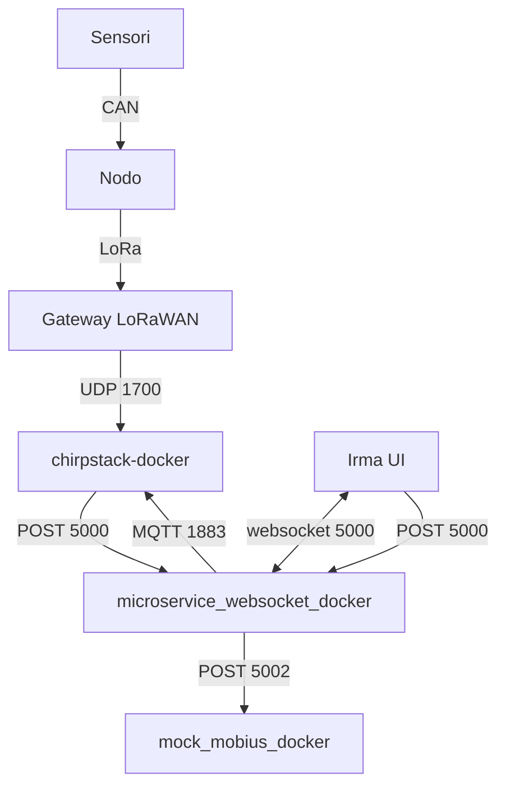
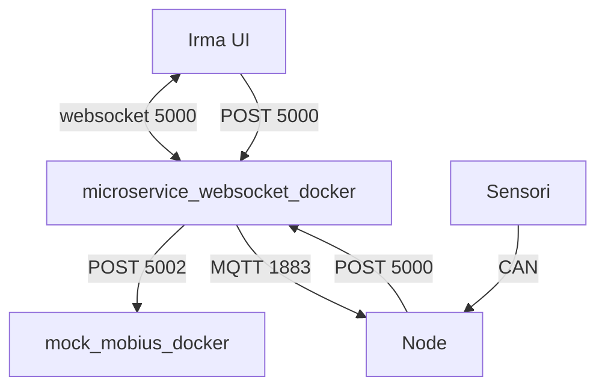
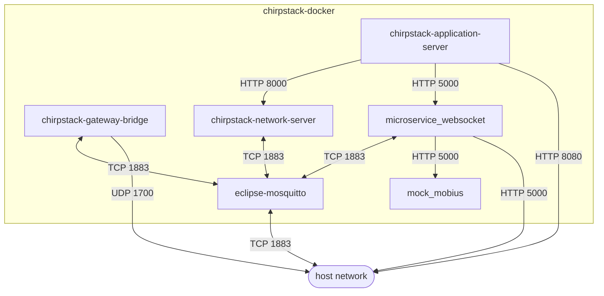
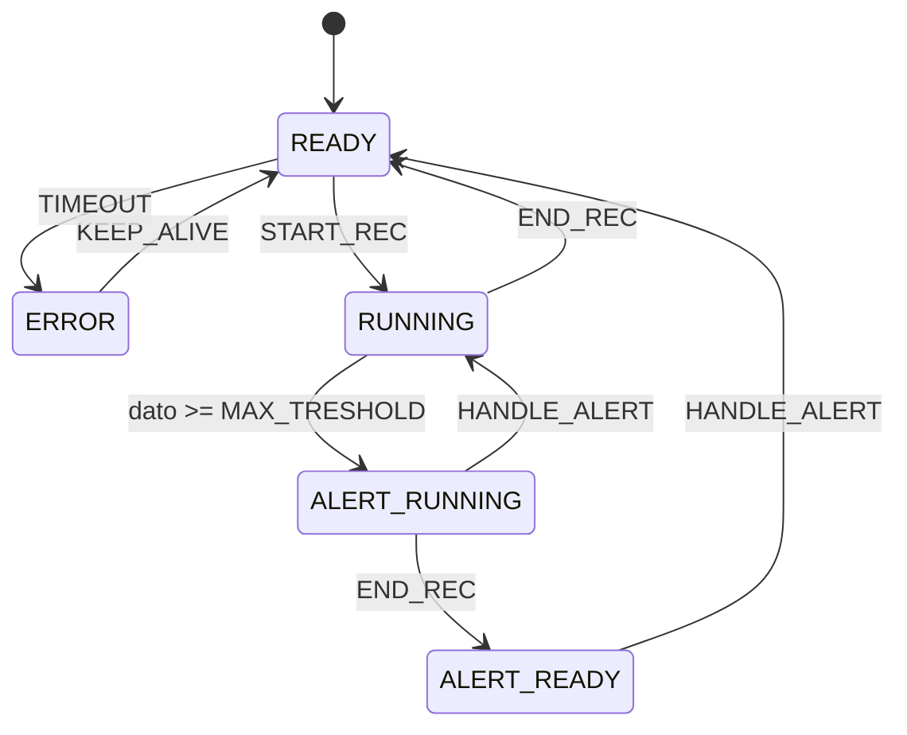
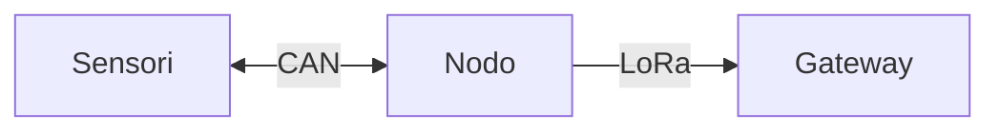
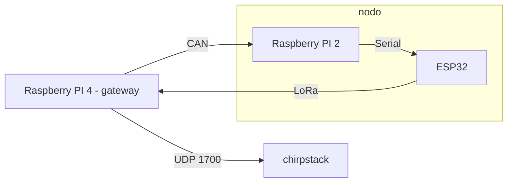

# PROGETTO IRMA 

## DESCRIZIONE PROGETTO

Rete di comunicazione a lunga gittata tramite protocollo LoRa per la trasmissione di dati raccolti da sensori verso il server che raccoglie e elabora i dati ritrasmettendoli tramite un web-service a una dashboard.

### Struttura progetto

Versione che implementa **LoRaWAN**:



---

Versione **senza LoRaWAN**:



## DEPLOYMENT

All'interno della **root** principale è presente il file [docker-compose.yaml](docker-compose.yaml), grazie al quale è possibile dispiegare l'intero stack di servizi, **chirpstack**, **mock_mobius** e **microservice_websocket**. All'interno della cartella [config](config/) sono presenti anche i file di configurazione dei vari servizi lanciati da docker.

Per utilizzare [docker-compose.yaml](docker-compose.yaml):

    docker-compose up -d
    
Per visualizzare i logs:

    docker-compose logs -f

Per fermare i container (e smontare i volumi):

    docker-compose down (-v)
    
Il [Chirpstack Application Server](https://www.chirpstack.io/application-server/) è raggiungibile mediante la porta 8080 sull'host. Le credenziali predefinite per accedere alla dashboard sono username: `admin` e password: `admin`.

### Encode e decode dei dati

Per agevolare la trasmissione, i dati vengono codificati in **stringhe base64**. Una volta convertita nuovamente in bytes, la struttura è la seguente:

    |payload_type: 1 byte|sensorData: 4 byte|mobius_sensorId: 10 byte|mobius_sensorPath: 10 byte| 

- `payload_type`: numoro **intero** che rappresenta il **tipo di messaggio** che viene inviato. Fare riferimento al capitolo sugli **Enum**.
- `sensorData`: numero **intero**, **big endian** che rappresenta la **lettura** del sensore.
- `mobius_sensorId`: **stringa** di 10 caratteri, padding a **destra**, richiesta per l'inserimento della lettura sulla piattaforma **Mobius**.
- `mobius_sensorPath`: **stringa** di 10 caratteri, padding a **destra**, richiesta per l'inserimento della lettura sulla piattaforma **Mobius**.

Esempio di **payload base64**: `AQAAAAdtb2JpdXNJZG1vYml1c1BhdGg=`

Lo stesso payload **decodificato**:

```json
{
  "payloadType": 1,
  "sensorData": 7,
  "mobius_sensorId": "mobiusId",
  "mobius_sensorPath": "mobiusPath"
}
```


### Encode e decode dei payload MQTT

Come per il paragrafo precedente, la trasmissione avviene con **strighe base64**. Una volta convertita nuovamente in bytes, la struttura è la seguente:

    |command: 1 byte|commandTimestamp: x bytes|

- `command`: numero **intero** che rappresenta il tipo di comando inviato. Fare riferimento al capitolo sugli **Enum**.
- `commandTimestamp`: **stringa** contenente un **timestamp ISO8601**, per raggruppare le letture relative ad un singolo comando di **start recording**.

### Struttura interna [docker-compose.yaml](docker-compose.yaml) (semplificata)



Per la versione [completa](assets/schema_docker_compose_completo.md).

## GLI ENUM

Per **ridurre** il **numero di dati** trasmessi, ma al contempo **mantenere la leggebilità**, sono stati creati diversi **IntEnum** per identificare diverse proprietà.

### PayloadType

Identifica i messaggi inviati.

| Nome         | Valore |
|--------------|--------|
| READING      |   0    |
| START_REC    |   1    |
| END_REC      |   2    |
| KEEP_ALIVE   |   3    |
| HANDLE_ALERT |   4    |


### CommandType
| Nome       | Valore |
|------------|--------|
| START_REC  |    0   |

### SensorState

Rappresenta lo stato che può essere assunto dai vari sensori.

| Nome          | Valore |
|---------------|--------|
| ERROR         |   0    |
| READY         |   1    |
| RUNNING       |   2    |
| ALERT_READY   |   3    |
| ALERT_RUNNING |   4    |

Il **cambiamento di stato** varia secondo il seguente schema:



## GATEWAY


Per la connessione del gateway è stato utilizzato un **HAT RAK2245** e un **Raspberry Pi 4B+** con relativa repository per l'installazione del service:
  
    $ sudo apt update; sudo apt install git -y
  
    $ git clone https://github.com/RAKWireless/rak_common_for_gateway.git ~/rak_common_for_gateway
  
    $ cd ~/rak_common_for_gateway
  
    $ sudo ./install.sh

Dopo queste operazioni si può eseguire il comando `sudo gateway-config` per configurare la connessione del proprio gateway al server.


## END-DEVICE

Per connettere un nuovo end-device su lorawan è necessario sapere il Device EUI che viene fornito dalla scheda che si usa e bisogna fare il join tramite una delle due modalità **(OTAA o ABP)**.

Bisogna creare una applicazione sul server tramite interfaccia web Applications > Create.

Successivamente va registrato il device Applications > [Nome applicazione_da_utilizzare] > Create.
Bisogna inserire il device EUI durante la registrazione, esso viene fornito dal produttore nella sua documentazione.

Sull'end device nel file [serial_esp_lora_oled.ino](arduino-py-communication/serial_esp_lora_oled.ino) vanno inseriti i dati relativi alle chiavi della rete che si trovano all'interno del menu del device creato in precedenza sul server.

Per la lettura dei dati va scritto un decoder su misura per i dati che verranno ricevuti sul device profile selezionato per la crezione del device sull'application server. Viene fornito un esempio qui: [encode_decode.js](chirpstack-docker/encode_decode.js).

Durante la fase di registrazione è necessario inserire anche i dati relativi alla piattaforma Mobius (sensorId e sensor_path) nella sezione Tags del sensore.

> :warning: **Warning**: *Il file **.ino** fornito nella repository è stato testato solo su un **Heltec ESP32** e non è garantito il funzionamento su altri dispositivi non basati su ESP32* :warning:


Per aggiungere la lettura dei dati dai sensori è stato utilizzato il protocollo CAN con l'aggiunta di un **Raspberry Pi 2B** in modo da ricevere i dati sulla interfaccia seriale 


## NODO

Sul nodo, nel nostro caso un Rapsberry PI 2, gira uno script che si occupa di **gestire** le **letture** dei sensori e i **comandi**.

Per maggiori informazioni consultare la [documentazione](./node/node.md).

### Struttura nodo/end-device



## WEB-SERVICE E SALVATAGGIO DEI DATI

Il server chirpstack non mantiene i dati trasmessi dagli end-device in nessun modo permanente, perciò sull'application server da interfaccia web deve essere attivata l'integrazione con HTTP, che permette di eseguire una POST con l'intero payload in formato JSON. 

I due servizi principali che si occupano di memorizzazione ed elaborazione dei dati sono:

- `microservice_websocket`.
- `mock_mobius` (che simula la piattaforma **Mobius**).

Per maggiori informazioni su **microservice_websocket** consultare la sua [documentazione](./microservice_websocket_docker/microservice_websocket.md).

### Avviare [mock_mobius](mock_mobius_docker/)

Come per [microservice_websocket_docker](microservice_websocket_docker/), è presente il file [docker-compose.yaml](mock_mobius_docker/docker-compose.yaml) che permette di far partire **standalone** il servizio di **mock_mobius** e il database [MongoDB](http://mongodb.com) ad esso associato.

Per i comandi di **docker-compose** fare riferimento al paragrafo **DEPLOYMENT**.

All'interno del docker-compose è possibile cambiare il mapping della **porta**, di default `5002`.

## COMANDI

Il file [downlink.py](utils/downlink.py) si occupa dell'invio dei comandi di Start e Stop all'application server tramite MQTT, che a sua volta invierà un messaggio di downlink verso l'end-device con il comando ricevuto e questo fermerà o avvierà la lettura dei dati dai sensori. Questo script serve per il test dei comandi senza dashboard.

Per l'utilizzo degli stessi comandi, ma da dashboard in remoto, si usa [microservice_websocket_docker](microservice_websocket_docker/), in particolare si effettua una **POST** su **/downlink**. Per maggiori informazioni consultare la [documentazione di microservic_websocket_docker](microservice_websocket_docker/microservice_websocket.md).

## TESTING IN LOCALE

Al fine di eseguire dei test in locale, per mancanza di una rete LoRaWAN da utilizzare, venogono utilizzati due script:

1. [auto_can.py](utils/auto_can.py) - 
    Questo script, eseguito (solo per test) sul gateway, invia tramite interfaccia CAN due messaggi a intervalli regolari.
    
2. [arduino_communication.py](utils/arduino-py-communication/arduino_communication.py) - 
    Questo script, eseguito su un Rapberry Pi connesso all'ESP32, riceve tramite interfaccia CAN i messaggi, che successivamente ritrasmetterà attraverso intefaccia seriale all'end-device.

Questo sistema sotituisce la necessità di una rete e di sensori funzionanti per fare test sul funzionameto della infrastruttura di rete.

### Struttura testing locale



### Inizializzazione interfaccia CAN

Per utilizzare l'interfaccia CAN è talvolta necessario inizializzarla prima di eseguire gli script sopra-citati.

Le istruzioni da eseguire sono:

    $ sudo modprobe peak_usb
    $ sudo ip link set can0 up type can bitrate 500000
    
Per maggiori informazioni consultare la documentazione di [python-can](https://python-can.readthedocs.io/en/stable/interfaces/socketcan.html#pcan).
