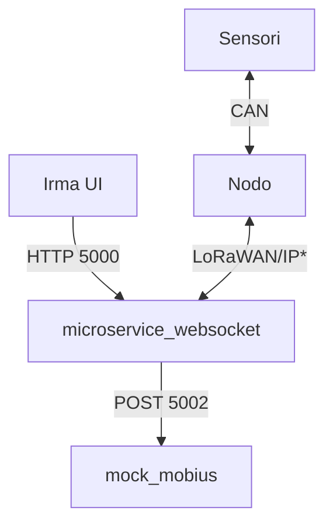
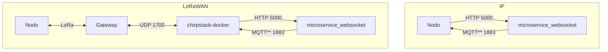
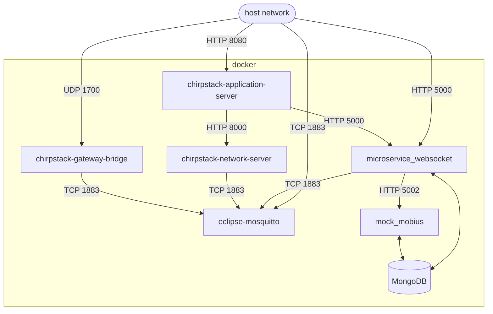
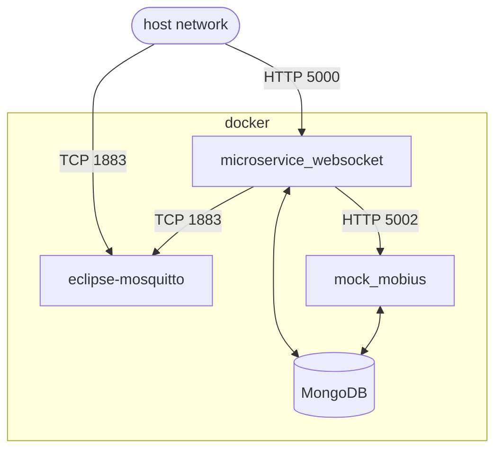
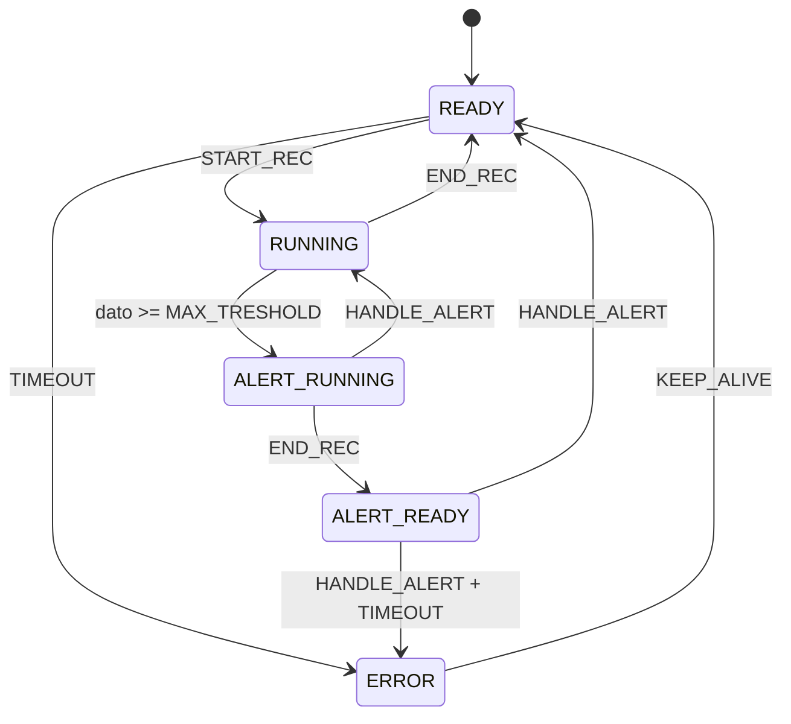
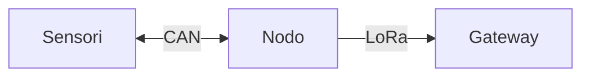
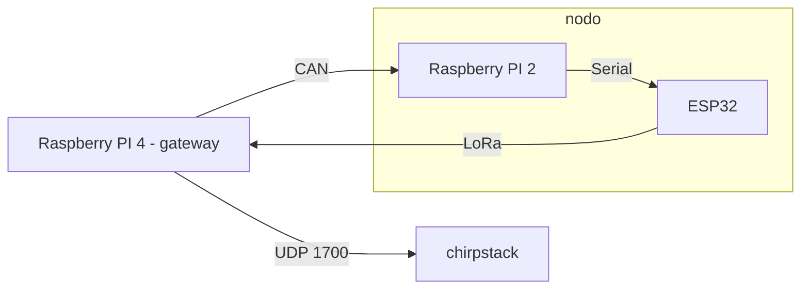

# PROGETTO IRMA 

I risultati dei test al seguente url:

* [https://irma-tests.netlify.app/](https://irma-tests.netlify.app/)

Per visualizzare la copertura del codice:

* [https://irma-tests.netlify.app/coverage](https://irma-tests.netlify.app/coverage)


## Descrizione progetto

Rete di comunicazione per **trasmissione e raccolta** dati dei sensori. Il server che li riceve si occupa poi di elaborarli ed inviarli alla **dashboard web** [irma-ui](https://github.com/monemasrl/irma-ui.git).

### Struttura progetto



> \*LoRaWAN/IP: vedi paragrafo successivo.

#### LoRaWAN/IP

La comunicazione tra **Nodo** e **microservice_websocket**, può avvenire in due modi: tramite [LoRaWAN](https://lora-alliance.org/about-lorawan/) o tramite una normale **connessione internet**.



> \*\*Per effettuare la comunicazione tramite MQTT è necessario un **Broker MQTT**.

Per maggiori informazioni su **chirpstack-docker** e sulla comunicazione tramite LoRa, fare riferimento a [LoRaWAN.md](./LoRaWAN.md).

## DEPLOYMENT

All'interno della **root** principale sono presenti due file **docker-compose**:

- [docker-compose.yaml](./docker-compose.yaml), grazie al quale è possibile dispiegare l'intero stack di servizi in **modalità IP**

- [docker-compose-chirpstack.yaml](./docker-compose-chirpstack.yaml), grazie al quale è possibile dispiegare l'intero stack di servizi in **modalità LoRaWAN**.

> Per maggiori informazione sulle **due modalità**, fare riferimento al paragrafo precedente.

### Schema dei docker-compose

#### docker-compose-chirpstack.yaml SIMPLIFIED



#### docker-compose.yaml



## I DATI

### Encode e decode dei dati

Per agevolare la trasmissione, i dati vengono codificati in **stringhe base64**. Una volta convertita nuovamente in bytes, la struttura è la seguente:

    |payload_type: 1 byte|sensorData: 4 byte|mobius_sensorId: 10 byte|mobius_sensorPath: 10 byte| 

- `payload_type`: numoro **intero** che rappresenta il **tipo di messaggio** che viene inviato. Fare riferimento al capitolo sugli **Enum**.
- `sensorData`: numero **intero**, **big endian** che rappresenta la **lettura** del sensore.
- `mobius_sensorId`: **stringa** di 10 caratteri, padding a **destra**, richiesta per l'inserimento della lettura sulla piattaforma **Mobius**.
- `mobius_sensorPath`: **stringa** di 10 caratteri, padding a **destra**, richiesta per l'inserimento della lettura sulla piattaforma **Mobius**.

Esempio di **payload base64**: `AQAAAAdtb2JpdXNJZCAgbW9iaXVzUGF0aA==`

Lo stesso payload **decodificato**:

```json
{
  "payloadType": 1,
  "sensorData": 7,
  "mobius_sensorId": "mobiusId",
  "mobius_sensorPath": "mobiusPath"
}
```


### Encode e decode dei payload MQTT

Come per il paragrafo precedente, la trasmissione avviene con **strighe base64**. Una volta convertita nuovamente in bytes, la struttura è la seguente:

    |command: 1 byte|commandTimestamp: x bytes|

- `command`: numero **intero** che rappresenta il tipo di comando inviato. Fare riferimento al capitolo sugli **Enum**.
- `commandTimestamp`: **stringa** contenente un **timestamp ISO8601**, per raggruppare le letture relative ad un singolo comando di **start recording**.


## GLI ENUM

Per **ridurre** il **numero di dati** trasmessi, ma al contempo **mantenere la leggebilità**, sono stati creati diversi **IntEnum** per identificare diverse proprietà.

### PayloadType

Identifica i messaggi inviati.

| Nome         | Valore |
|--------------|--------|
| READING      |   0    |
| START_REC    |   1    |
| END_REC      |   2    |
| KEEP_ALIVE   |   3    |
| HANDLE_ALERT |   4    |


### CommandType
| Nome       | Valore |
|------------|--------|
| START_REC  |    0   |

### SensorState

Rappresenta lo stato che può essere assunto dai vari sensori.

| Nome          | Valore |
|---------------|--------|
| ERROR         |   0    |
| READY         |   1    |
| RUNNING       |   2    |
| ALERT_READY   |   3    |
| ALERT_RUNNING |   4    |

Il **cambiamento di stato** varia secondo il seguente schema:



## NODO

Sul nodo, nel nostro caso un Rapsberry PI 2, gira uno script che si occupa di **gestire** le **letture** dei sensori e i **comandi**.

Per maggiori informazioni consultare la [documentazione](./node/node.md).

### Struttura nodo/end-device



## WEB-SERVICE E SALVATAGGIO DEI DATI

Il server chirpstack non mantiene i dati trasmessi dagli end-device in nessun modo permanente, perciò sull'application server da interfaccia web deve essere attivata l'integrazione con HTTP, che permette di eseguire una POST con l'intero payload in formato JSON. 

I due servizi principali che si occupano di memorizzazione ed elaborazione dei dati sono:

- `microservice_websocket`.
- `mock_mobius` (che simula la piattaforma **Mobius**).

Per maggiori informazioni su **microservice_websocket** consultare la sua [documentazione](./microservice_websocket/microservice_websocket.md).

### Avviare [mock_mobius](mock_mobius/)

Come per [microservice_websocket](microservice_websocket/), è presente il file [docker-compose.yaml](mock_mobius/docker-compose.yaml) che permette di far partire **standalone** il servizio di **mock_mobius** e il database [MongoDB](http://mongodb.com) ad esso associato.

Per i comandi di **docker-compose** fare riferimento al paragrafo **DEPLOYMENT**.

All'interno del docker-compose è possibile cambiare il mapping della **porta**, di default `5002`.

## COMANDI

Il file [downlink.py](utils/downlink.py) si occupa dell'invio dei comandi di Start e Stop all'application server tramite MQTT, che a sua volta invierà un messaggio di downlink verso l'end-device con il comando ricevuto e questo fermerà o avvierà la lettura dei dati dai sensori. Questo script serve per il test dei comandi senza dashboard.

Per l'utilizzo degli stessi comandi, ma da dashboard in remoto, si usa [microservice_websocket](microservice_websocket/), in particolare si effettua una **POST** su **/downlink**. Per maggiori informazioni consultare la [documentazione di microservic_websocket](microservice_websocket/microservice_websocket.md).

## TESTING IN LOCALE

Al fine di eseguire dei test in locale, per mancanza di una rete LoRaWAN da utilizzare, venogono utilizzati due script:

1. [auto_can.py](utils/auto_can.py) - 
    Questo script, eseguito (solo per test) sul gateway, invia tramite interfaccia CAN due messaggi a intervalli regolari.
    
2. [arduino_communication.py](utils/arduino-py-communication/arduino_communication.py) - 
    Questo script, eseguito su un Rapberry Pi connesso all'ESP32, riceve tramite interfaccia CAN i messaggi, che successivamente ritrasmetterà attraverso intefaccia seriale all'end-device.

Questo sistema sotituisce la necessità di una rete e di sensori funzionanti per fare test sul funzionameto della infrastruttura di rete.

### Struttura testing locale



### Inizializzazione interfaccia CAN

Per utilizzare l'interfaccia CAN è talvolta necessario inizializzarla prima di eseguire gli script sopra-citati.

Le istruzioni da eseguire sono:

    $ sudo modprobe peak_usb
    $ sudo ip link set can0 up type can bitrate 500000
    
Per maggiori informazioni consultare la documentazione di [python-can](https://python-can.readthedocs.io/en/stable/interfaces/socketcan.html#pcan).
