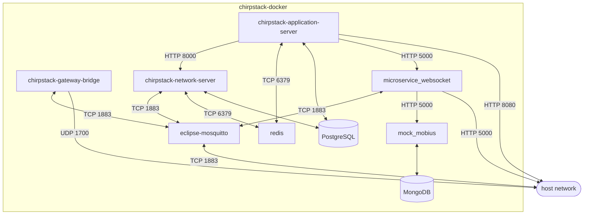

# Struttura interna [docker-compose.yaml](../docker-compose.yaml) (completa)

```mermaid
graph TD;
subgraph chirpstack-docker;
  direction LR;
    redis[redis]
    cgb[chirpstack-gateway-bridge]
    cns[chirpstack-network-server]
    cas[chirpstack-application-server]
    mqtt[eclipse-mosquitto]
    mobius[mock_mobius]
    mongo[(MongoDB)]
    msw[microservice_websocket]
    db[(PostgreSQL)]

    mobius <--> mongo
    cgb & cns & msw <-- TCP 1883 --> mqtt
    cas -- HTTP 8000 --> cns
    cas & cns <-- TCP 6379 --> redis
    cns & cas <--> db
    msw -- HTTP 5000 --> mobius
    cas -- HTTP 5000 --> msw
end
out([host network])
mqtt <-- TCP 1883 --> out
cas -- HTTP 8080 --> out
msw -- HTTP 5000 --> out
cgb -- UDP 1700 --> out
```
