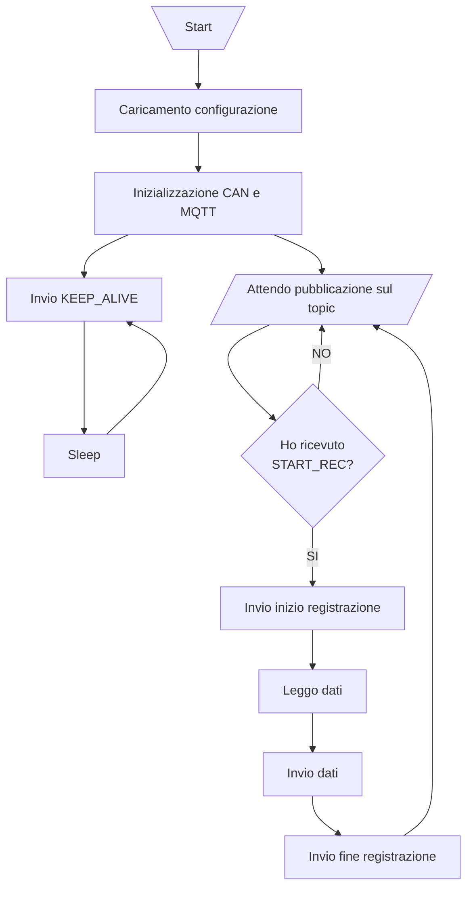

# Node

## Schema di collegamento

Il nodo comunica con i sensori tramite [interfaccia CAN](https://it.wikipedia.org/wiki/Controller_Area_Network).

### Inizializzazione interfaccia CAN

Per utilizzare l'interfaccia CAN è talvolta necessario inizializzarla prima di eseguire gli script sopra-citati.

Le istruzioni da eseguire sono:

    $ sudo modprobe peak_usb
    $ sudo ip link set can0 up type can bitrate 500000

Per maggiori informazioni consultare la documentazione di [python-can](https://python-can.readthedocs.io/en/stable/interfaces/socketcan.html#pcan).

## Lo script

Questo script si occupa di gestire la lettura dei sensori e gestire lo stato di registrazione.

### Schema di comportamento

### Avviare lo script

Dopo aver inizializzato l'interfaccia CAN (fare riferimento al [readme principale](../README.md)), basta eseguire `app.py` con l'interprete di python:

    python3 app.py

### Configurare lo script

È possibile configurare lo script mediante il file [config.yaml](./config.yaml).

### Modalità di testing

Per effettuare il **testing**, è possibile avviare lo script settando la **variabile d'ambiente** `BYPASS_CAN`.

Questo **non inizializzerà** l'interfaccia CAN e chiederà all'utente di **inserire manualmente** i dati, quando richiesti.
