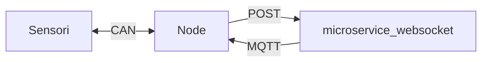
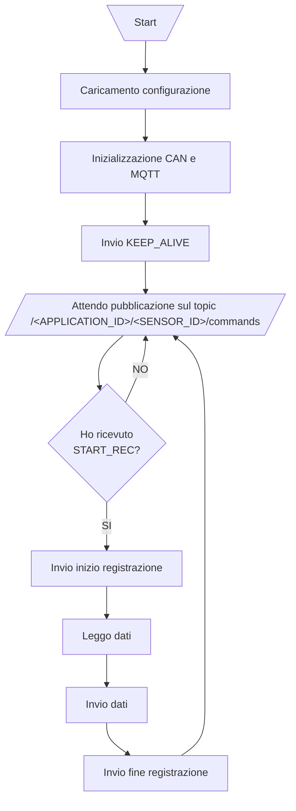

# Node

## Schema di collegamento

## Lo script

Questo script si occupa di gestire la lettura dei sensori e gestire lo stato di registrazione.

### Schema di comportamento

### Avviare lo script

Dopo aver inizializzato l'interfaccia CAN (fare riferimento al [readme principale](../README.md)), basta eseguire `app.py` con l'interprete di python:

    python3 app.py

### Configurare lo script

È possibile configurare lo script mediante il file [config.yaml](./config.yaml).

